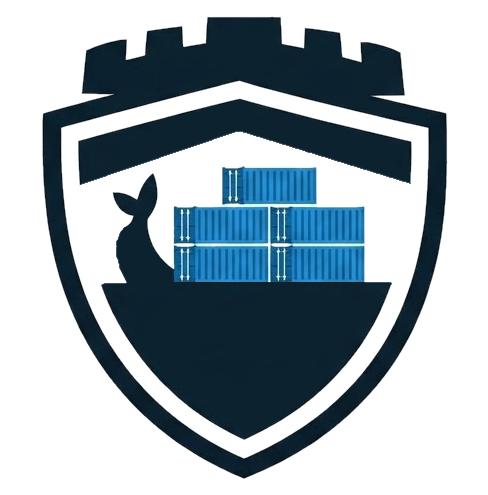

<p align="center">
  
</p>
<h1 align="center">Bulwark</h1>
<p align="center"><strong>Safe, policy-driven Docker container updater with digest-based change detection and rollback capability.</strong></p>

Bulwark is a Docker container update management tool designed for safety, transparency, and control. Unlike aggressive auto-updaters, Bulwark provides:

- **Opt-in only** - Nothing updates without explicit configuration
- **Digest-based detection** - Reliable change detection via image digests
- **Policy tiers** - notify (check only), safe (full probes), aggressive (minimal checks)
- **Health gating** - Multi-tier probes: HEALTHCHECK → HTTP → TCP → Log → Stability
- **Automatic rollback** - Reverts to previous digest on probe failure
- **Stateful protection** - Never auto-updates databases without explicit override

## Features

- **Discovery**: Scans Docker Compose projects and labeled containers
- **Update Detection**: Compares local vs remote registry digests
- **Safe Updates**: Applies updates with health probes and rollback
- **Notification Scheduling**: Cron-based immediate alerts or daily digests
- **Compose-aware**: Uses `docker compose` for proper project handling
- **Loose Container Support**: Manages standalone containers via definition labels

## Quick Start

### Installation

```bash
go install github.com/itsmrshow/bulwark/cmd/bulwark@latest
```

Replace `github.com/itsmrshow/bulwark` with your actual repo path if you fork.

Or build from source:

```bash
git clone https://github.com/itsmrshow/bulwark.git
cd bulwark
make build
```

### Basic Usage

```bash
# Discover managed targets
bulwark discover

# Check for available updates
bulwark check

# Plan updates (dry-run)
bulwark plan

# Apply updates
bulwark apply

# Run the Web Console (API + UI)
bulwark serve
```

## Web Console (UI)

Bulwark includes a production-ready Web Console that is **read-only by default**. Write actions (apply/rollback) must be explicitly enabled and are protected by a bearer token.

### Local development

```bash
# Terminal 1: run the API/UI server
export BULWARK_UI_ENABLED=true
export BULWARK_UI_READONLY=true
bulwark serve

# Terminal 2: run the frontend dev server
cd web
npm install
npm run dev
```

Open `http://localhost:5173` for the Vite dev server (it proxies `/api` to `http://localhost:8080`).

### Docker Compose (recommended)

```bash
cp .env.example .env
# Edit .env as needed (do not commit it)
docker compose up -d --build bulwark
```

Visit `http://localhost:8085` to access the Web Console (default compose port).

### Docker (single container)

```bash
docker build -t bulwark:dev .
docker run --rm -p 8080:8080 \
  -v /var/run/docker.sock:/var/run/docker.sock \
  -v /docker_data:/docker_data:ro \
  -e BULWARK_UI_ENABLED=true \
  -e BULWARK_UI_READONLY=true \
  bulwark:dev
```

Visit `http://localhost:8080` to access the Web Console.

## Docker Hub CI (GitHub Actions)

This repo includes a workflow to build and push Docker images to Docker Hub on:
- pushes to `main` (tagged as `latest`)
- semantic version tags like `v1.2.3`

Required GitHub secrets:
- `DOCKERHUB_USERNAME` – your Docker Hub username
- `DOCKERHUB_TOKEN` – a Docker Hub access token
- `DOCKERHUB_REPO` – the full image name (e.g., `myuser/bulwark`)
- `RELEASE_PAT` – PAT used by auto-tag workflow so tag pushes trigger `docker-publish`

### Automatic versioning

On every push to `main`, a GitHub Action creates a new patch tag (e.g., `v1.0.1`, `v1.0.2`).  
The Docker publish workflow picks up those tags and pushes versioned images.

To skip auto-tagging for a commit, include `[skip release]` in the commit message.

### Enabling write actions

```bash
export BULWARK_UI_READONLY=false
export BULWARK_WEB_TOKEN="your-strong-token"
```

Then add `Authorization: Bearer <token>` for write requests, or enter the token in the UI header.

### Notifications (Discord / Slack)

Configure notification webhooks in **Settings** inside the Web Console. You can:

- Enable Discord and/or Slack webhooks
- Send immediate notifications when updates are found
- Schedule a daily digest using cron expressions

Notifications are only sent when updates are available.

Environment overrides:
- `DISCORD_WEBHOOK_URL` / `SLACK_WEBHOOK_URL` will preconfigure webhooks and lock them in the UI.
- `BULWARK_NOTIFY_ON_FIND` enables immediate notifications without using the UI.
- `BULWARK_NOTIFY_DIGEST` enables digest notifications without using the UI.
- `BULWARK_NOTIFY_CHECK_CRON` / `BULWARK_NOTIFY_DIGEST_CRON` override the notification schedules.
- Settings are persisted to `/data/bulwark.json` by default (configure with `BULWARK_DATA_DIR` or `BULWARK_CONFIG_PATH`).

## Label Configuration

Enable Bulwark management on your containers using labels:

### Compose Project

```yaml
services:
  nginx:
    image: nginx:latest
    labels:
      - bulwark.enabled=true
      - bulwark.policy=safe
      - bulwark.tier=stateless
      - bulwark.probe.type=http
      - bulwark.probe.url=http://localhost:80
      - bulwark.probe.expect_status=200
```

### Stateful Service (Protected)

```yaml
services:
  postgres:
    image: postgres:15
    labels:
      - bulwark.enabled=true
      - bulwark.policy=notify  # Only notify, never auto-update
      - bulwark.tier=stateful
```

### Loose Container

```bash
docker run -d \
  --name myapp \
  --label bulwark.enabled=true \
  --label bulwark.policy=safe \
  --label bulwark.definition=compose:/docker_data/myapp/docker-compose.yml#service=myapp \
  --label bulwark.probe.type=tcp \
  --label bulwark.probe.tcp_host=localhost \
  --label bulwark.probe.tcp_port=8080 \
  myapp:latest
```

## Label Reference

### Core Labels

- `bulwark.enabled=true|false` - Enable Bulwark management (required)
- `bulwark.policy=notify|safe|aggressive` - Update policy (default: safe)
- `bulwark.tier=stateless|stateful` - Service tier (default: stateless)
- `bulwark.definition=compose:/abs/path/compose.yml#service=<service>` - For loose containers

### Probe Labels

- `bulwark.probe.type=http|tcp|log|stability` - Probe type
- `bulwark.probe.url=<url>` - HTTP probe URL
- `bulwark.probe.expect_status=<code>` - Expected HTTP status (default: 200)
- `bulwark.probe.tcp_host=<host>` - TCP probe host
- `bulwark.probe.tcp_port=<port>` - TCP probe port
- `bulwark.probe.log_pattern=<regex>` - Log pattern to match
- `bulwark.probe.stability_sec=<seconds>` - Stability window duration

## Environment Variables

- `BULWARK_ROOT=/docker_data` - Base path for compose discovery
- `BULWARK_STATE_DB=/var/lib/bulwark/state.db` - State database location (SQLite)
- `BULWARK_LOG_LEVEL=debug|info|warn|error` - Logging verbosity

### Web Console

- `BULWARK_UI_ENABLED=true|false` - Enable the Web Console (default: true)
- `BULWARK_UI_READONLY=true|false` - Read-only mode (default: true)
- `BULWARK_WEB_TOKEN=...` - Required bearer token for write actions
- `BULWARK_UI_ADDR=:8080` - UI/API listen address
- `BULWARK_UI_DIST=web/dist` - Path to built UI assets
- `BULWARK_PLAN_CACHE_TTL=15s` - Cache TTL for overview/plan calculations
- `BULWARK_WEB_WRITE_RPS=1` - Write endpoint rate limit (requests per second)
- `BULWARK_WEB_WRITE_BURST=3` - Write endpoint burst capacity

## Security Considerations

⚠️ **Docker Socket Access**: Bulwark requires access to `/var/run/docker.sock`, which provides full Docker daemon control. Run Bulwark in a trusted environment only.

- Web Console is read-only by default
- Write actions require `BULWARK_WEB_TOKEN` and bearer auth
- Keep the API on an internal network and use a reverse proxy (Traefik/HAProxy/Cloudflare Access) for additional auth
- Stateful services (databases) protected by default

## Development

```bash
# Install dependencies
go mod download

# Build
make build

# Run tests
make test

# Run linter
make lint

# Build Docker image
make docker-build
```

## Roadmap

### v1.0 (Complete! 🎉)

- [x] Basic project structure
- [x] Docker client integration (Phase 1)
- [x] CLI framework (Phase 1)
- [x] Discovery engine (Phase 2) - Compose + loose containers
- [x] Registry digest checking (Phase 3) - Docker Hub
- [x] Policy engine (Phase 3) - notify/safe/aggressive
- [x] SQLite state persistence (Phase 5)
- [x] Update executor (Phase 6) - Compose + container updates
- [x] Health probes (Phase 7) - HTTP/TCP/Docker/Stability
- [x] Automatic rollback (Phase 8) - On probe failure
- [x] Scheduler (Phase 9) - Cron-based automation
- [x] Web UI dashboard (Phases 1-7) - Production-ready React app
- [x] API backend - REST API with async operations

### v1.1 (Planned)

- [ ] Webhook server - Docker Hub/Harbor push notifications
- [ ] Prometheus metrics endpoint
- [ ] Grafana dashboard templates
- [ ] Log pattern probe (regex-based health checks)

### v2.0 (Future)

- Private registry auth helpers and broader registry support
- Notification integrations (email, PagerDuty, etc.)
- Update windows (time-based restrictions)
- Canary deployments (gradual rollouts)
- Pre/post update hooks (custom scripts)

## License

MIT License - see LICENSE file for details.

## Contributing

Contributions welcome! Please see CONTRIBUTING.md for guidelines.
